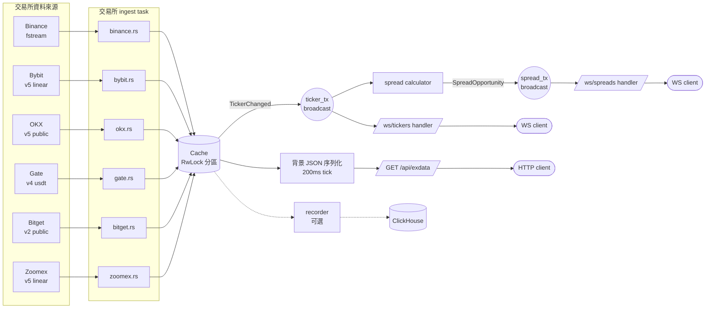
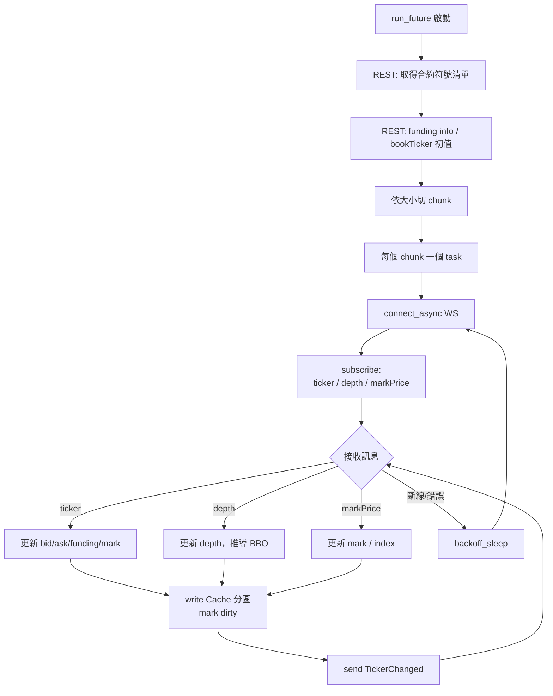
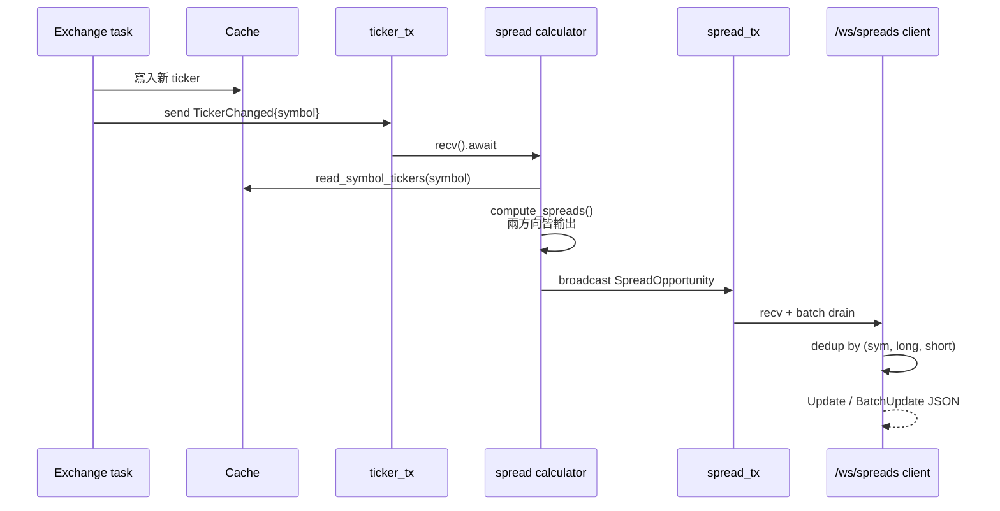

# exdata

多交易所永續合約行情聚合與套利價差計算服務。以 Rust + Tokio + Axum 實作，透過 WebSocket 訂閱六家交易所的即時行情，於記憶體中合併計算跨交易所價差，並以 REST 與 WebSocket 對外提供聚合資料。

## 特色

- **多交易所支援**：Binance、Bybit、OKX、Gate、Bitget、Zoomex 永續合約市場
- **事件驅動價差引擎**：以 `broadcast` 通道取代輪詢，ticker 異動即時觸發重算
- **depth 驅動 BBO**：從 depth 增量直接推導最佳買賣價，移除獨立 `bookTicker` 訂閱以降低連線與延遲
- **雙向價差輸出**：每組交易所對同時推送兩個方向，避免單向過濾造成資料陳舊
- **背景 JSON 序列化**：將序列化從 WS 熱路徑解耦，減少寫鎖競爭
- **可選 ClickHouse 記錄**：透過 `config.toml` 啟用行情寫入

## 架構

### 整體資料流



### 單一交易所 ingest 生命週期

各交易所模組共用相同骨架：啟動時以 REST 抓取符號清單與 funding info，之後將符號切 chunk 並為每個 chunk 起一個 WS 連線，訂閱 ticker / depth / markPrice 等頻道。收到訊息後更新 Cache 並發出 `TickerChanged`，斷線時指數退避重連。



### 各交易所端點與頻道

| 交易所 | WS Endpoint | 訂閱頻道 | BBO 來源 |
|--------|-------------|----------|----------|
| Binance | `wss://fstream.binance.com/stream` | `!ticker@arr`, `!markPrice@arr@1s`, `<sym>@depth20` | depth |
| Bybit | `wss://stream.bybit.com/v5/public/linear` | `tickers.<sym>`, `orderbook.<n>.<sym>` | depth |
| OKX | `wss://ws.okx.com:8443/ws/v5/public` | `tickers`, `books`, `mark-price` | depth |
| Gate | `wss://fx-ws.gateio.ws/v4/ws/usdt` | `futures.tickers`, `futures.order_book` | depth |
| Bitget | `wss://ws.bitget.com/v2/ws/public` | `ticker`, `books15` | depth |
| Zoomex | `wss://stream.zoomex.com/v5/public/linear` | `tickers.<sym>`, `orderbook.<n>.<sym>` | depth |

### Spread 計算事件流



主要模組：

| 模組 | 說明 |
|------|------|
| `exchanges/` | 每家交易所的 WS 訂閱與 REST 補齊邏輯 |
| `cache.rs` | 以交易所為單位的分區 `RwLock` 快取 |
| `spread.rs` | Ticker 事件驅動的跨交易所價差計算 |
| `ws.rs` | `/ws/spreads` 全市場價差、`/ws/tickers` 依倉位訂閱 |
| `api.rs` | `/api/exdata` 聚合 REST（gzip 壓縮，Cache-Control 1s）|
| `recorder.rs` | 可選 ClickHouse 行情記錄 |

## 對外介面

- `GET /api/exdata` — 聚合六家交易所的最新快照 JSON
- `WS /ws/spreads` — 連線後先收全量 snapshot，後續推送增量 update / batchUpdate
- `WS /ws/tickers` — 依倉位訂閱，client 送 `{action:"subscribe"|"unsubscribe", symbol, long_exchange, short_exchange}`

兩個 WS 端點皆有 30s ping / 60s pong 超時機制。

## 快速開始

```bash
cargo run --release
# 服務監聽 0.0.0.0:3000
```

```toml
[recorder]
enabled = true
clickhouse_url = "http://localhost:8123"
clickhouse_user = "default"
clickhouse_password = ""
```

```bash
cargo check
cargo build --release
```

